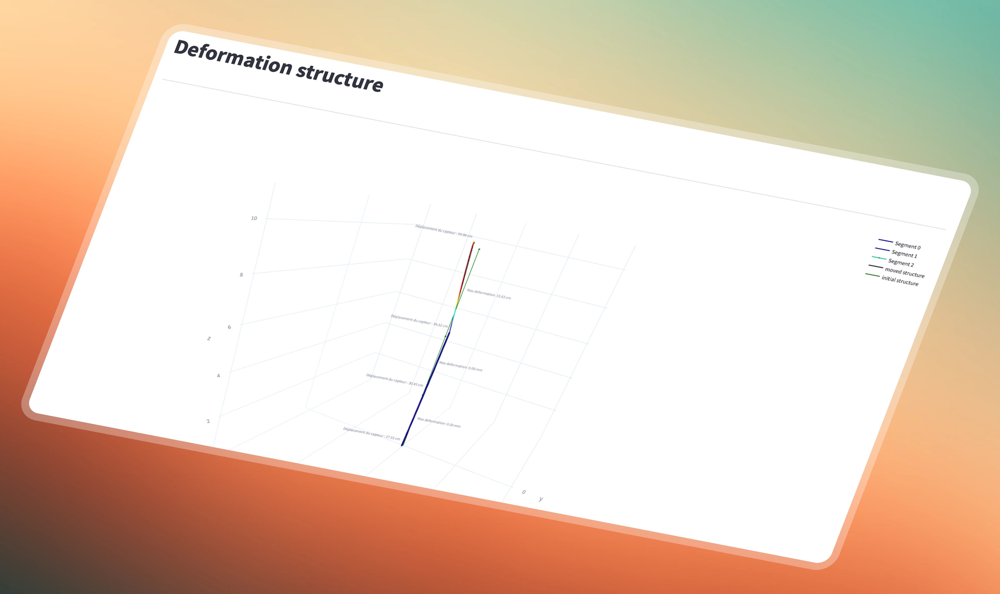

# Calcul et visualisation de la déformation d'une structure
[]() &nbsp; [](https://medium.com/@antoninlefevre45/suivi-de-la-déformation-de-structures-75a54c3b1efc) &nbsp; []() &nbsp; []()

Ce projet vise à développer un système de surveillance de la déformation d'une structure en temps réel, en utilisant une combinaison de capteurs d'accélération et de gyroscopes. Trois capteurs MPU6050 sont utilisés pour détecter les variations d'accélération et de rotation (gyroscope) sur trois points spécifiques de la structure. Ces capteurs sont connectés à des modules ESP32 qui transmettent les données collectées à un serveur MQTT local. Un script Python récupère ces données, les traite pour estimer la déformation de la structure et les stocke dans une base de données MongoDB pour une analyse ultérieure. Les déformations de la structure sont visualisées en temps réel à l'aide d'une courbe de Bézier 3D, ce qui permet d'observer l'évolution de l'inclinaison et du mouvement de la structure. Ce système offre une solution de surveillance structurelle en temps réel.

Il faudra lancer le serveur mongodb:

```bash
brew services start mongodb-community
```

Puis lancer l'interface:

```bash
streamlit run streamlit_app.py
```

<br>

<p align="center">
  
</p>

<br>