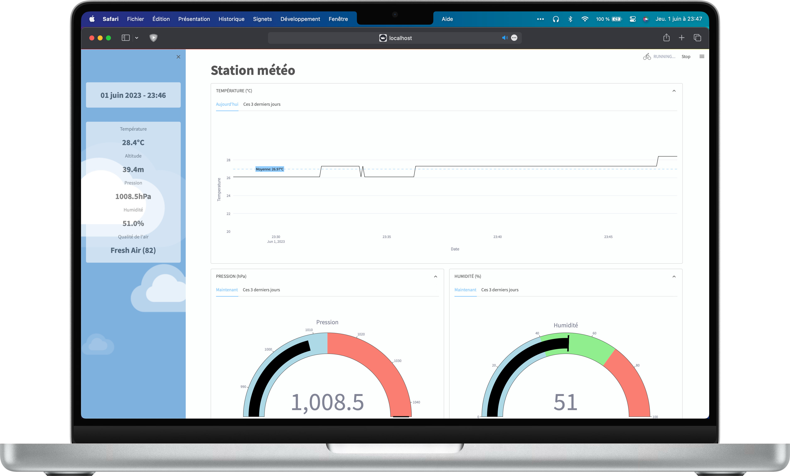

# Station météo intelligente
[](https://medium.com/@antoninlefevre45/conception-dune-station-météo-connectée-et-intelligente-avec-esp32-et-mqtt-a349edad7ffc) &nbsp; []() &nbsp; []() &nbsp; []() &nbsp; []()

Ce projet vise à développer une station météorologique connectée et intelligente. Elle sera équipée de divers capteurs : le BMP180 pour mesurer la température et la pression atmosphérique, le HTU21 pour l'humidité et un capteur Grove pour évaluer la qualité de l'air. Les données collectées par ces capteurs seront transmises grâce à un ESP32 à un serveur MQTT local sur un Mac. Ce serveur, en plus d'afficher les informations reçues en utilisant un script Python, sera capable de stocker ces données pour les visualiser grâce à un dashboard avec streamlit. La station météo fournira des informations en temps réel sur les conditions environnementales, contribuant à une meilleure compréhension et prévision du climat local.

Pour lancer l'interface, le serveur MQTT et la lecture des données du serveur, exécutez la commande suivante dans le dossier du projet (n'oubliez pas d'ajouter les droits):

```bash
./run_weather_station.sh
```
 
**Aperçu**
<p align="center">
  
</p>

<br>