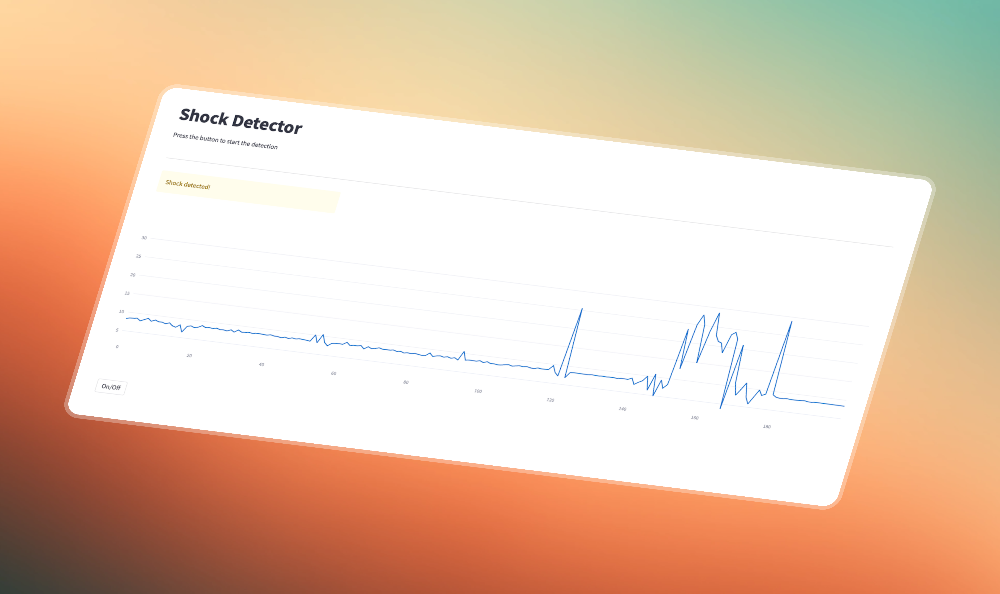
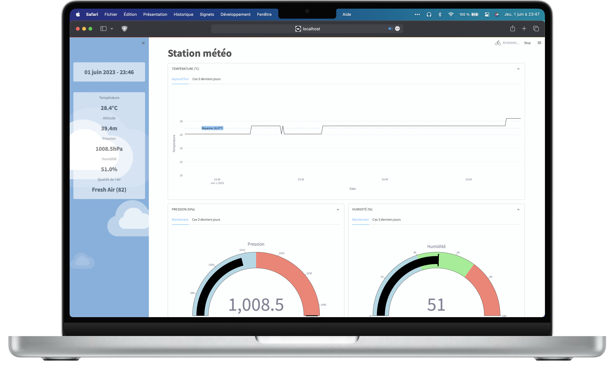
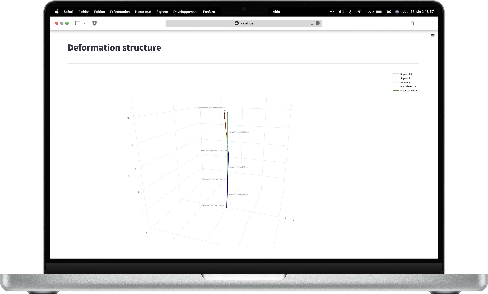

<h1 align="center">
  <br>
  <a href="http://www.amitmerchant.com/electron-markdownify"></a>
  <br><br>
  Data science & IoT
  <br>
</h1>

<h4 align="center">Découvrez la data science avec l'IoT au travers de divers projets.</h4>

<p align="center">
 <a href="#"></a>
 &nbsp;
 <a href="#"></a>
 &nbsp;
 <a href="#"></a>
 &nbsp;
 <a href="#"></a>
 &nbsp;
 <a href="#"></a>
&nbsp;
 <a href="#"></a>
&nbsp;
<a href="#"></a>
&nbsp;
<a href="https://eliobot.com"></a>

</p>

<p align="center">
  <a href="#liens-utiles">Liens utiles</a> •
  <a href="#introduction">Introduction</a> •
  <a href="#projets">Projets</a>
</p>

<br>

# Liens utiles

- Documentation [Arduino](https://docs.arduino.cc/?_gl=1*q1xbuk*_ga*MTE1NjQ3NzM5Mi4xNjI5OTk4MDM0*_ga_NEXN8H46L5*MTYzMTIyMDEzMy4xMi4xLjE2MzEyMjAxMzMuMA..)

- Chaîne YouTube [U=RI](https://www.youtube.com/channel/UCVqx3vXNghSqUcVg2nmegYA) <br>

- Chaîne YouTube [BoilingBrains](https://www.youtube.com/channel/UCKAzZCVzqkdvxX6VLTwyVMQ) <br>

- Site d'achat de matériel [AZ-Delivery](https://www.az-delivery.de/fr/)

<br>

# Introduction

Dans ce dépôt, vous trouverez une collection de projets combinant **IoT** et **Data Science**, en utilisant des plateformes comme **Arduino**, **Raspberry Pi** ou encore **ESP32**. Les codes sources sont disponibles et accompagnés d'instructions détaillées pour faciliter leur reproduction. En intégrant l'Internet des objets et l'intelligence artificielle, ces projets visent à explorer les applications pratiques et les limites de ces technologies dans divers domaines. N'hésitez pas à suggérer de nouveaux projets à inclure et à partager vos impressions sur ceux déjà présents.

Pour faciliter la recherche en fonction de vos besoins, chaque projet est doté de badges. Les **badges noirs** sont des liens servant à rediriger vers le code source ou un article lié. Les **badges blancs** correspondent aux outils utilisés pour le projet, comme le framework de data science ou le matériel utilisé. 

<br>

# Projets

### À venir

[](https://eliobot.com) &nbsp; []() &nbsp; []()

### Détection d'anomalies vibratoires avec capteur accéléromètre et auto-encodeur de débruitage
[](Projets/Anomalies_vibratoires_accelerometre_AE_debruitage/README.md) &nbsp; [](https://medium.com/@antoninlefevre45/auto-encodeur-de-débruitage-pour-la-détection-danomalies-vibratoires-117d2ad3a94b) &nbsp; []() &nbsp;  []() &nbsp; []()

Ce projet permet de détecter les chocs en temps réel à l'aide d'un modèle d'autoencodeur de débruitage et d'un capteur d'accélération. 
L'objectif est d'identifier les chocs parmi les données du capteur en éliminant le bruit et les variations normales d'accélération.
Nous utiliserons le capteur MPU-6050 (GY-521) et un Arduino Uno pour collecter les données d'accélération. L'interface pour visualiser 
les données en temps réel est développé avec Streamlit. 

Pour lancer l'interface, exécutez la commande suivante dans le dossier du projet :

```bash
streamlit run streamlit_real_time_interface.py
```

<br>

<p align="center">
  
</p>

<br>

### Station météo intelligente
[](Projets/Station_meteo_prediction_temps_ML/README.md) &nbsp; [](https://medium.com/@antoninlefevre45/conception-dune-station-météo-connectée-et-intelligente-avec-esp32-et-mqtt-a349edad7ffc) &nbsp; []() &nbsp; []() &nbsp; []() &nbsp; []()

Ce projet vise à développer une station météorologique connectée et intelligente. Elle sera équipée de divers capteurs : le BMP180 pour mesurer la température et la pression atmosphérique, le HTU21 pour l'humidité et un capteur Grove pour évaluer la qualité de l'air. Les données collectées par ces capteurs seront transmises grâce à un ESP32 à un serveur MQTT local sur un Mac. Ce serveur, en plus d'afficher les informations reçues en utilisant un script Python, sera capable de stocker ces données pour les visualiser grâce à un dashboard avec streamlit. La station météo fournira des informations en temps réel sur les conditions environnementales, contribuant à une meilleure compréhension et prévision du climat local.

Pour lancer l'interface, le serveur MQTT et la lecture des données du serveur, exécutez la commande suivante dans le dossier du projet (n'oubliez pas d'ajouter les droits):

```bash
./run_weather_station.sh
```
 
<br>

<p align="center">
  
</p>

<br>

### Calcul et visualisation de la déformation d'une structure
[](Projets/Deformation_structure/README.md) &nbsp; [](https://medium.com/@antoninlefevre45/suivi-de-la-déformation-de-structures-75a54c3b1efc) &nbsp; []() &nbsp; []() &nbsp; []()

Ce projet vise à développer un système de surveillance de la déformation d'une structure en temps réel, en utilisant une combinaison de capteurs d'accélération et de gyroscopes. Trois capteurs MPU6050 sont utilisés pour détecter les variations d'accélération et de rotation (gyroscope) sur trois points spécifiques de la structure. Ces capteurs sont connectés à des modules ESP32 qui transmettent les données collectées à un serveur MQTT local. Un script Python récupère ces données, les traite pour estimer la déformation de la structure et les stocke dans une base de données MongoDB pour une analyse ultérieure. Les déformations de la structure sont visualisées en temps réel à l'aide d'une courbe de Bézier 3D, ce qui permet d'observer l'évolution de l'inclinaison et du mouvement de la structure. Ce système offre une solution de surveillance structurelle en temps réel.

Il faudra lancer le serveur mongodb:

```bash
brew services start mongodb-community
```

Puis lancer l'interface:

```bash
streamlit run streamlit_app.py
```

<br>
<p align="center">
  
</p>

<br>

---

> Website [antoninlefevre.com](https://antonin-lfv.github.io) &nbsp;&middot;&nbsp;
> GitHub [@antonin-lfv](https://github.com/antonin-lfv) &nbsp;&middot;&nbsp;
> Linkedin [@antonin](https://www.linkedin.com/in/antonin-lefevre-0110)
